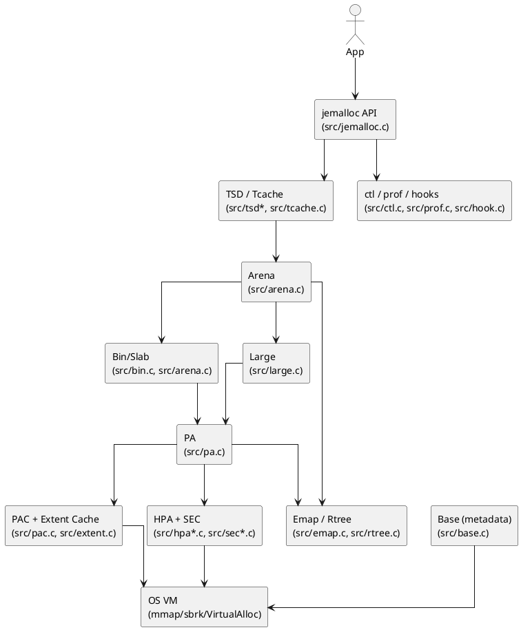
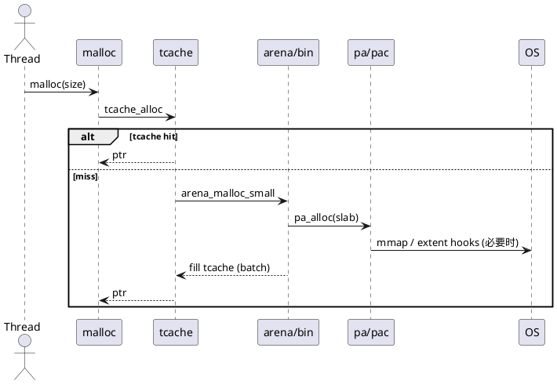
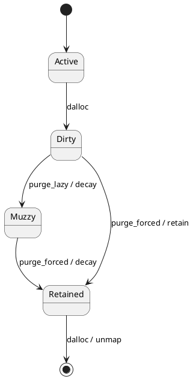

# jemalloc 设计文档（基于本仓库源码）

> 本文根据 /workspace 当前源码（分支 cursor/jemalloc-cceb）阅读整理，
> 覆盖 jemalloc 的整体架构、核心模块与关键流程。
> 主要参考文件：
> - src/jemalloc.c, src/arena.c, src/tcache.c, src/large.c
> - src/pa.c, src/pac.c, src/extent.c, src/emap.c, src/rtree.c, src/sc.c
> - src/base.c, src/decay.c, src/background_thread.c
> - include/jemalloc/internal/*.h
> - doc/jemalloc.xml.in, doc_internal/PROFILING_INTERNALS.md

## 目录

1. 设计目标与原则
2. 总体架构
3. 核心概念与数据结构
4. 线程本地数据与快速路径（TSD / Tcache）
5. Arena 设计
6. 小对象分配与释放流程
7. 大对象分配与释放流程
8. Page Allocator 与 Extent 管理（PA / PAC / HPA / SEC）
9. 元数据与地址映射（emap / rtree）
10. 元数据分配器 Base
11. 回收与后台维护（decay / background thread）
12. 配置与控制接口（mallctl / stats）
13. Profiling / Hooks / 安全诊断
14. 关键权衡与可扩展点
15. 代码地图（核心文件速查）

---

## 1. 设计目标与原则

jemalloc 的核心目标来自 README 与实现细节：

- **低碎片与稳定性**：通过 size class、slab、extent 复用降低外部和内部碎片。
- **可扩展并发**：多 arena + per-thread tcache，减少全局锁争用。
- **可观测与可调**：提供 mallctl 统计、参数调优与 profiling 能力。
- **可配置与可扩展**：支持 runtime 选项、extent hooks、hook API。
- **安全与诊断**：支持 junk 填充、guard page、double free 检测等。

这些目标直接映射到代码结构：tcache 与 arena 是性能主干，pa/pac/extent
是内存复用与系统交互主干，emap/rtree 是元数据定位主干。

---

## 2. 总体架构



整体路径可概括为：

1. API 入口（malloc/free/mallocx/rallocx 等）。
2. TSD 快速路径 + tcache 命中直接返回。
3. tcache miss 进入 arena 的 bin/large 逻辑。
4. arena 通过 pa_shard 调用 PAC/HPA 申请或回收 extent。
5. emap/rtree 保证地址到元数据的快速查询。
6. base 负责元数据自身的内存分配。

---

## 3. 核心概念与数据结构

### 3.1 Page / Extent / Slab / Region

- **Page**：最小页粒度（PAGE），所有 extent 以页对齐。
- **Extent（edata_t）**：一段连续页区间，是 jemalloc 的基本管理单位。
  - 见 include/jemalloc/internal/edata.h，包含 state、szind、slab 标志等。
- **Slab**：小对象的载体，一个 extent 可能被划分成若干小 region。
- **Region**：slab 内每个固定大小的小对象。

简化示意：

```
Extent (slab)
┌─────────────────────────────────────────┐
│ region0 │ region1 │ region2 │ ... │ rN │
└─────────────────────────────────────────┘
bitmap 跟踪每个 region 是否占用
```

### 3.2 edata_t 元数据

`edata_t` 是每个 extent 的元数据结构，关键字段（见 edata.h）：

- **e_bits**：位域记录 arena_ind、slab、committed、state、szind 等。
- **e_addr / e_size**：对应的地址与大小。
- **e_sn**：serial number（用于排序与断言）。
- **链表/堆链接**：用于 active、cache、bin slabs 等多种队列场景。

在 emap 中还缓存了 `edata_map_info_t`（slab + szind），减少指针跳转。

### 3.3 Size Class

size class 由 `src/sc.c` 计算，核心规律：

- Tiny size（< quantum）按 2 的幂次增长。
- 非 tiny 区间按 “每倍 4 个 size class” 的策略分组。
- `slab_size()` 选择页的最小公倍数，使 region 完整排列。

根据 doc/jemalloc.xml.in：

- **小对象**：小于 4 * page 的 size class（SC_SMALL_MAXCLASS）。
- **大对象**：从 4 * page 到最大 size class。

这保证了 **内部碎片约 20%**（小对象除外）与快速查表（sz.h/sc.h）。

---

## 4. 线程本地数据与快速路径（TSD / Tcache）

### 4.1 TSD 机制

TSD 在 `include/jemalloc/internal/tsd.h` 中定义。核心点：

- 提供 **fast path**：`tsd_fetch()` 返回线程本地结构。
- `tsd_state_nominal` 时走快速路径；非 nominal 进入 slow path。
- TSD 内缓存 rtree ctx、tcache、arena 绑定等数据。

### 4.2 Tcache

实现见 `src/tcache.c`：

- 每线程独立缓存，按 size class 维护 `cache_bin_t`。
- 默认 `opt_tcache=true`，可通过 mallctl 或 flags 关闭。
- 填充策略：`tcache_bin_fill` 从 arena bin 批量取。
- 释放策略：`tcache_dalloc` 先入本线程缓存。
- GC 策略：按 `opt_tcache_gc_incr_bytes` 等参数触发周期性回收。

tcache 的优势是 **大多数小对象分配完全无锁**，代价是占用额外内存。

---

## 5. Arena 设计

### 5.1 多 Arena

来自 doc/jemalloc.xml.in 与 arena.c：

- 默认 `narenas = 4 * ncpus`（可调）。
- 每 arena 独立管理内存，减少锁竞争。
- 支持 percpu_arena 模式，线程动态绑定 CPU 对应 arena。

### 5.2 Arena 结构

`include/jemalloc/internal/arena_structs.h`：

- `bins`：按 size class 的 bin 数组（可分 shard）。
- `large`：大对象链表（large_mtx 保护）。
- `pa_shard`：页级分配器（PA）。
- `base`：该 arena 的元数据分配器。
- `tcache_ql`：记录关联的 tcache 列表用于统计。

### 5.3 Bin 与 Slab

- `bin_info_t`（include/jemalloc/internal/bin_info.h）：
  - `reg_size`：region 大小（size class）。
  - `slab_size`：slab 大小（页对齐）。
  - `nregs`：slab 中 region 数量。
  - `n_shards`：bin 分片数量，降低锁竞争。
- `bin_t`（include/jemalloc/internal/bin_types.h）：
  - `slabcur`：当前优先使用的非满 slab。
  - `slabs_nonfull`：非满 slab 堆（按地址排序）。
  - `slabs_full`：满 slab 链表。
  - `lock`：bin 级互斥锁。
- 远程释放优化：
  - 对部分 size class 使用 `bin_with_batch_t` 进行 remote free batching，
    降低跨线程释放的锁开销（见 src/bin.c 与 batcher）。

---

## 6. 小对象分配与释放流程

### 6.1 关键步骤（分配）

1. **size class 计算**：
   - `sz_s2u(size)` 或 `sz_sa2u(size, alignment)` 计算 `usize`。
2. **tcache 命中**（若开启）：
   - `tcache_alloc` 直接弹出缓存对象。
3. **tcache miss**：
   - 进入 `arena_malloc_small()`（src/arena.c）。
4. **bin 分配**：
   - 加锁 bin，尝试从 `slabcur` 或 `slabs_nonfull` 分配。
5. **slab 不足**：
   - `arena_slab_alloc()` 通过 `pa_alloc` 申请新 slab。
6. **bitmap 分配 region**：
   - `arena_slab_reg_alloc()` 使用 bitmap 获取空闲 region。
7. **更新统计与返回**：
   - bin stats、arena stats 更新，必要时 zero 填充。

### 6.2 关键步骤（释放）

1. **tcache 回收**：
   - 优先进入线程本地缓存。
2. **tcache 触发 flush**：
   - 超过阈值时批量归还给 arena。
3. **arena_dalloc_bin**：
   - 使用 emap 找到 edata，锁住 bin，回收 region。
4. **slab 为空**：
   - `arena_slab_dalloc()` 释放 slab 回到 pa_shard。

### 6.3 小对象分配序列图



---

## 7. 大对象分配与释放流程

### 7.1 分配流程

1. **arena 选择**：
   - `arena_choose_maybe_huge()` 根据 size 与配置选择 arena。
   - 当超过 `oversize_threshold` 时可能进入 huge arena。
2. **large_palloc**：
   - `large_palloc()` 计算对齐后的 `ausize`。
3. **extent 分配**：
   - `arena_extent_alloc_large()` 调用 `pa_alloc()`。
4. **注册元数据**：
   - emap 中注册 boundary，更新 szind/slab 标志。
5. **统计与返回**：
   - 非 auto arena 会挂入 `arena->large` 链表。

### 7.2 重新分配（realloc）

`large_ralloc_no_move()` 尝试原地扩展或收缩：

- 扩展：`pa_expand()`，要求相邻空间可用。
- 收缩：`pa_shrink()`，要求 extent 支持 split。
- 若失败：重新分配并 memcpy。

### 7.3 释放流程

- `large_dalloc` 从 `arena->large` 移除（若非 auto arena）。
- `arena_extent_dalloc_large()` 归还给 `pa_dalloc()`。

---

## 8. Page Allocator 与 Extent 管理（PA / PAC / HPA / SEC）

### 8.1 抽象层次

- **PA（pa_shard）**：arena 级页分配器入口（src/pa.c）。
- **PAI 接口**：统一抽象 alloc/expand/shrink/dalloc（pai.h）。
- **PAC**：传统 extent 缓存与回收逻辑（src/pac.c）。
- **HPA**：Huge Page Aware 分配器（src/hpa*.c）。
- **SEC**：小 extent cache，配合 HPA 使用（src/sec*.c）。

PA 在分配时优先走 HPA（若启用），否则退回 PAC。

### 8.2 PAC 的 extent cache

PAC 维护三个主要 cache（ecache）：

- **dirty**：已释放但仍保留物理页的 extent。
- **muzzy**：已 lazy purge 的 extent。
- **retained**：仅保留虚拟地址空间的 extent。

关键策略（src/pac.c, src/extent.c）：

- dirty 延迟 coalesce（提高复用率）。
- muzzy/retained 立即 coalesce（非关键路径）。
- extent split / merge 支持 in-place shrink/expand。

### 8.3 Extent 状态机

状态来自 `edata.h`：

- active / dirty / muzzy / retained
- transition / merging（中间态）



### 8.4 HPA（Huge Page Aware）

HPA 以 hugepage 为基本单位组织 pageslab：

- 中央分配器（hpa_central）从 OS 扩展 eden。
- shard 通过 pageslab 切分并分配给 arena。
- 统计 hugify/dehugify 过程。

启用 HPA 可减少 TLB miss 与提升大页利用率，但需要系统支持与配置配合。

### 8.5 Extent Hooks

`ehooks` 为扩展点（include/jemalloc/internal/ehooks.h）：

- 默认 hooks 使用 mmap/sbrk。
- 支持用户自定义 alloc/dalloc/commit/decommit/purge/split/merge。
- 提供 reentrancy guard，避免在 hooks 内部递归分配造成死锁。

---

## 9. 元数据与地址映射（emap / rtree）

### 9.1 emap

`src/emap.c` 负责地址到 edata 的映射：

- `emap_register_boundary()`：注册 extent 边界。
- `emap_register_interior()`：slab 内部页注册。
- `emap_remap()`：更新 szind/slab 等元信息。

### 9.2 rtree

`src/rtree.c` 实现 radix tree：

- 多级节点懒初始化。
- 每线程 rtree_ctx 有 L1/L2 cache（见 tsd）。
- 提供快速 `emap_edata_lookup()` 支持 free / sallocx。

### 9.3 作用

emap/rtree 是 jemalloc 的“索引系统”，保证从任意指针快速定位：

- 对象属于哪个 arena。
- 属于哪个 size class。
- 是否 slab 内部。

---

## 10. 元数据分配器 Base

`src/base.c` 负责元数据自身的分配：

- 每 arena 有独立 base。
- base 通过 extent hooks 申请大块元数据。
- 支持 metadata THP（`opt_metadata_thp`），在达到阈值后使用大页。

base 与用户数据分离，避免 arena reset 影响内部元数据。

---

## 11. 回收与后台维护（decay / background thread）

### 11.1 decay

`src/decay.c` 使用 smoothstep 曲线：

- `dirty_decay_ms` / `muzzy_decay_ms` 控制回收节奏。
- backlog 记录历史，平滑收敛到目标。

### 11.2 background thread

`src/background_thread.c`：

- `opt_background_thread` 控制启用。
- 后台线程周期性触发 arena decay / purge。
- 可减少前台分配路径的 purge 开销。

---

## 12. 配置与控制接口（mallctl / stats）

入口见 `src/jemalloc.c` 与 `src/ctl.c`：

- `malloc_conf`：启动配置字符串（环境变量或符号覆盖）。
- `mallctl` 树形命名空间：
  - `opt.*`（运行时参数）
  - `stats.*`（统计信息）
  - `arena.*`、`arenas.*`（arena 级控制）

典型参数：

- `opt.narenas`：arena 数量。
- `opt.tcache` / `opt.tcache_max`：tcache 设置。
- `opt.dirty_decay_ms` / `opt.muzzy_decay_ms`：回收时间。
- `background_thread`：后台线程启用。

---

## 13. Profiling / Hooks / 安全诊断

### 13.1 Profiling

`src/prof.c` 与 `doc_internal/PROFILING_INTERNALS.md`：

- 采用 **按字节采样（per-byte sampling）**。
- 通过抽样修正得到无偏估计。
- 记录 allocation size、stack trace、tctx。

### 13.2 Hooks

两类 hook：

- **extent hooks**：替换底层 VM 操作。
- **malloc hook**：在 alloc/dalloc/realloc 等点触发（hook.c）。

### 13.3 安全诊断

- `junk` / `junk_free`：填充无效字节帮助发现 UAF。
- `safety_check`：双重释放检测等。
- `san`：guard page 与 sanitizer 相关支持。

---

## 14. 关键权衡与可扩展点

1. **tcache vs 内存**：更快的 fast path 换取更多缓存占用。
2. **多 arena vs 碎片**：更低锁争用但可能增加全局碎片。
3. **延迟 coalesce vs 复用**：dirty 延迟合并提高复用速度。
4. **HPA vs 兼容性**：大页提升性能但依赖系统支持。
5. **后台 purge vs 前台延迟**：后台线程降低延迟但增加线程成本。

扩展点主要在：

- extent hooks（自定义 VM 交互）。
- malloc hook（采样或监控）。
- mallctl（运行时动态调优）。

---

## 15. 代码地图（核心文件速查）

- **API 入口**：src/jemalloc.c
- **Arena / Small**：src/arena.c, src/bin.c, include/*/bin_info.h
- **Tcache**：src/tcache.c, include/*/cache_bin.h
- **Large**：src/large.c
- **Size class**：src/sc.c, include/*/sc.h, include/*/sz.h
- **PA / PAC / Extent**：src/pa.c, src/pac.c, src/extent.c
- **HPA / SEC**：src/hpa*.c, src/sec*.c
- **emap / rtree**：src/emap.c, src/rtree.c
- **Base**：src/base.c
- **Decay / BG thread**：src/decay.c, src/background_thread.c
- **Profiling**：src/prof.c, doc_internal/PROFILING_INTERNALS.md
- **Control / Stats**：src/ctl.c, doc/jemalloc.xml.in


